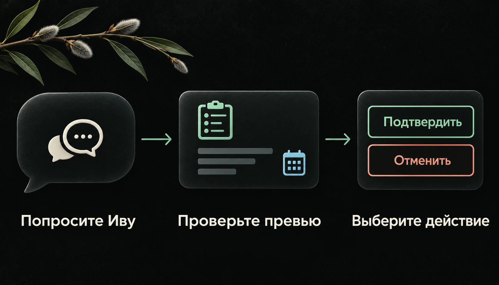

<div align="center">


# Bitrix24 в переписке с Ивой

**Узнавайте, что происходит с задачами, находите документы и поручайте изменения прямо в Telegram.**

[](https://github.com/mamysh/iva-bitrix24/releases)
[](https://github.com/mamysh/iva-bitrix24/actions/workflows/ci.yml)
[](LICENSE)

[Что попросить](#что-попросить-у-ивы) · [Изменить задачу](#как-меняются-задачи) · [Установить](#установить) · [Обновить](#обновить-плагин) · [Помощь](#если-нужна-помощь)

</div>

Плагин подключает задачи вашего Bitrix24 к [Иве](https://github.com/smixs/iva-agent).
Спросите о просроченных задачах, попросите разобраться в обсуждении или найти приложенный
документ. Чтобы создать задачу или изменить существующую, Ива подготовит превью и предложит
подтвердить действие кнопкой.

**Стабильная версия — 0.6.0.** Создание и закрытие задачи проверены владельцем в боевой работе
на актуальной Иве Шимы. Остальные операции покрыты автоматическими тестами;
[подробности проверки и совместимости](docs/COMPATIBILITY.md).

## Что попросить у Ивы

| Напишите в чате | Что сделает Ива |
| --- | --- |
| «Покажи мои просроченные задачи» | Найдёт доступные задачи с истёкшим сроком. |
| «Почему у этой задачи поменялся срок?» | Посмотрит историю и обсуждение, объяснит найденные причины. |
| «Найди презентацию в задачах моего отдела» | Найдёт документы по имени и контексту, предложит выбрать нужный. |
| «Разбери документ из этой задачи» | Скачает выбранный файл для разбора; возможности зависят от формата и программ на сервере. |
| «Создай задачу: проверить макет. Описание: сверить текст и цены. Ответственный — Иван Тестов. Срок — 6 октября 2026, 18:00, Минск» | Найдёт сотрудника и покажет полное превью перед созданием. |
| «Добавь комментарий: макет проверен» | Подготовит сообщение в обсуждение выбранной задачи. |
| «Перенеси срок этой задачи на 8 октября 2026, 18:00, Минск» | Покажет новый срок и предложит подтвердить изменение. |
| «Закрой эту задачу» | Подготовит завершение или принятие результата, если задача ожидает контроля. |

Если задача или сотрудник определены неоднозначно, Ива уточнит, кого вы имеете в виду.
Она видит только то, к чему есть доступ у подключённого пользователя Bitrix24.

## Как меняются задачи



1. **Опишите действие.** Для новой задачи нужны название, описание, ответственный и срок.
   По желанию добавьте проект, наблюдателей, соисполнителей или чек-лист.
2. **Проверьте превью.** Ива покажет, что собирается сделать. Напишите правку, если нужно
   что-то изменить: она подготовит новое превью.
3. **Выберите кнопку.** **Подтвердить** запускает действие, **Отменить** отменяет черновик.
   После выполнения Ива сообщает результат.

Так работают создание, комментарии, загрузка файла в чат задачи, завершение, возврат на
доработку, смена срока и ответственного. Для смены ответственного текущий исполнитель должен
находиться в подчинении у пользователя подключения, а права Bitrix24 должны разрешать изменение.

*Картинки иллюстрируют сценарий; это не скриншоты интерфейса.*

<details>
<summary><b>Подробности подтверждения и ограничений</b></summary>

Превью действует 30 минут. Новый черновик заменяет предыдущий. Перед записью плагин повторно
проверяет права и состояние задачи. Если результат запроса неизвестен, он не повторяет запись
автоматически; сначала нужно выяснить, что произошло.

Кнопки обрабатывает Ива, а ответ передаётся плагину через модель. Плагин фиксирует содержание
черновика, но не может самостоятельно удостоверить нажатие кнопки. Это ограничение сохраняется
в стабильной версии. [Точный контракт действий](docs/TASK_WRITES.md) · [Защита данных](SECURITY.md).

</details>

## Документы из задач — под рукой

Ива ищет файлы среди вложений задачи, её обсуждения и чек-листа. Показывает список с номерами
и контекстом: выберите один, несколько или все. При обычном разборе задач она сначала
отвечает по задаче, затем предлагает посмотреть файлы. Если вы сразу попросили документ,
лишний вопрос пропускается.

Чтобы получить файл настоящим вложением в Telegram, установите
[плагин доставки файлов](https://github.com/mamysh/iva-file-delivery).
Для просмотра страниц PDF нужен `pdftoppm`, для страниц Word, Excel и презентаций —
LibreOffice. Мастер установки объяснит, чего не хватает. Поиск внутри содержимого документов
Ива запускает по прямой просьбе.

## Установить

Нужны работающая Ива **0.4.0 или новее**, её Linux-сервер и доступ к настройкам входящего
webhook Bitrix24. Webhook — секретный адрес, через который плагин получает разрешённый
доступ к вашему порталу. [Как подготовить подключение](docs/SETUP.md#1-подготовьте-bitrix24).

На сервере под пользователем Ивы выполните:

```bash
curl -fsSL https://raw.githubusercontent.com/mamysh/iva-bitrix24/main/install.sh | bash
```

Русскоязычный мастер установит стабильный плагин, поможет выбрать права, примет webhook
скрытым вводом и проверит подключение. Секретный адрес вводите только в мастере на сервере.

Для чтения нужны права **Задачи**. Для действий с задачами также нужны минимальные права
**Пользователи**, для обсуждения и загрузки файлов — **Чат и уведомления**. Проекты,
подразделения и документы могут требовать дополнительные права:
[таблица и настройка](docs/SETUP.md#1-подготовьте-bitrix24).
Права webhook не расширяют доступ самого сотрудника к задачам.

[Ручная установка и Marketplace](docs/SETUP.md) ·
[Переход с RC на stable](docs/SETUP.md#переход-с-rc-на-stable).

## Первые сообщения после подключения

Начните с проверки:

> Проверь подключение и покажи возможности Bitrix24.

Затем попросите список задач:

> Покажи мои открытые задачи.

Для первой записи используйте вымышленную тестовую задачу и доступного сотрудника:

> Создай тестовую задачу «Проверить подключение». Описание: убедиться, что создание работает.
> Ответственный — я. Срок — 6 октября 2026, 18:00, Минск.

Проверьте превью и нажмите **Подтвердить**. Затем попросите закрыть эту тестовую задачу
и подтвердите действие. Так вы проверите запись именно с правами своего подключения.

## Обновить плагин

Напишите в личном чате с Ивой:

> Проверь обновление плагина Bitrix24.

Ива покажет версии и предложит кнопку **Обновить**. После подтверждения обновление выполнится
в фоне; Ива может ненадолго перезапуститься. При неуспешной диагностике плагин попытается
вернуть предыдущую версию. Затем спросите:

> Как прошло обновление плагина Bitrix24?

Обычная установка и Marketplace следуют каналу `stable`. Если плагин закреплён за тегом RC,
сначала [переведите его на stable](docs/SETUP.md#переход-с-rc-на-stable).

## Что важно знать

- Подключение работает от имени пользователя, создавшего webhook, в пределах его прав.
- Плагин предоставляет перечисленные действия с задачами. CRM, удаление задач и произвольные
  команды Bitrix24 в текущую версию не входят.
- Отправка файла в обсуждение задачи требует современного чата задачи. Один файл — до 50 МиБ.
- При частичной ошибке чек-листа задача уже может быть создана: Ива сообщит результат,
  повторно создавать её не нужно.
- Не отправляйте webhook в Telegram, публичные обращения или журналы.
  [Хранение секрета и доступ к данным](SECURITY.md).

## Если нужна помощь

[Установка и подсказки по ошибкам](docs/SETUP.md) ·
[Сообщить о проблеме](https://github.com/mamysh/iva-bitrix24/issues).

Укажите версии Ивы и плагина, код ошибки и шаги на вымышленном примере.
Webhook, реальные документы и полные ответы вашего портала прикладывать не нужно.

| Подробнее | Где прочитать |
| --- | --- |
| Установка, права, обновление и удаление | [Руководство](docs/SETUP.md) |
| Что проверено и с какими версиями | [Совместимость](docs/COMPATIBILITY.md) |
| Изменения в выпусках | [История версий](CHANGELOG.md) |
| Разрешённые действия и их ограничения | [Контракт действий](docs/TASK_WRITES.md) |

<details>
<summary><b>Для тех, кто хочет улучшить плагин</b></summary>

Плагин работает через изолированный MCP-процесс.
[Инструменты](docs/TOOLS.md) · [Устройство](docs/DESIGN.md) ·
[Правила участия](CONTRIBUTING.md) · [Выпуск версии](docs/RELEASING.md) ·
[Картинки и промпты](docs/VISUALS.md).

```bash
npm ci
npm run check
```

</details>

Независимый плагин для Ивы. Не является официальным продуктом Bitrix24 и не аффилирован с ним.
Лицензия — [MIT](LICENSE).
